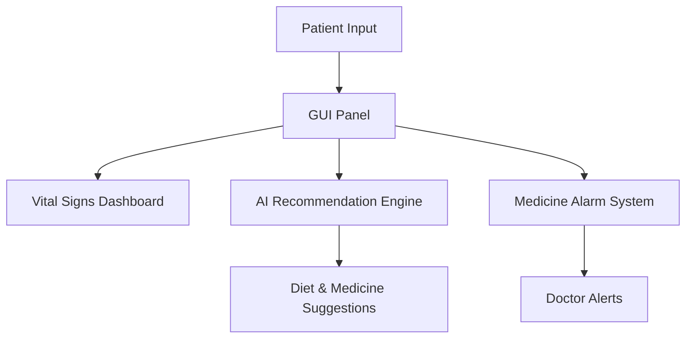

# 🏥 Personal Health & Emotion-Aware Virtual Assistant (PHEV)

[](https://www.python.org/)
[]()
[](LICENSE)
[]()

---

## 📌 Overview

The **Personal Health & Emotion-Aware Virtual Assistant (PHEV)** is an **AI-powered healthcare support system** designed to:

✔️ Monitor patient health in real time
✔️ Suggest treatments & diet plans
✔️ Provide medicine alarms & doctor alerts
✔️ Assist doctors in better decision-making

👉 Fully interactive **Tkinter-based GUI** for patients and doctors.

---

## ✨ Features

* 📊 **Vital Signs Dashboard** – Real-time charts for blood pressure, heart rate, and pulse
* 🤖 **AI Recommendation Engine** – Treatment, diet & medicine suggestions
* ⏰ **Medicine Alarm System** – Automatic reminders for medicine intake
* 👨‍⚕️ **Doctor Alerts** – Emergency alerts to doctors
* 💊 **Alternative Medicine Suggestions** – Substitutes with same generic
* 🥗 **Dietary Suggestions** – Food plans for recovery/chronic conditions
* 📅 **Weekly Health Report** – Log daily entries and generate summary charts
* 🎨 **Modern GUI** – Clean, tabbed interface

---

## 🎥 Demo Previews

📊 **Vital Signs Dashboard** 

🤖 **AI Recommendation Engine** 

⏰ **Medicine Alarm System** 

👨‍⚕️ **Doctor Alert Notification** 

---

## 🖼️ UML Prototype



---

## 🚀 Tech Stack

**Language:** Python (3.10+)
**Libraries Used:**

* `tkinter` → GUI
* `matplotlib` → Charts
* `threading` → Alarm & notifications
* `datetime` → Scheduling
* `random` → AI recommendation simulation

---

## 📂 Project Structure

<details>
<summary>Click to expand</summary>

```
phev/
│── main.py                 # Entry point
│── gui/
│   └── main_gui.py         # Tkinter GUI
│── core/
│   ├── ai_engine.py        # AI Recommendation Engine
│   ├── doctor_alert.py     # Doctor Alert System
│   └── medicine_alarm.py   # Automated Medicine Alarm
│── data/
│   └── patient_data.json   # Patient info
│── docs/
│   └── IEEE_Paper.pdf      # Project paper
```

</details>

---

## ⚙️ Installation

```bash
# Clone the repo
git clone https://github.com/yourusername/phev-assistant.git
cd phev-assistant

# Install dependencies
pip install matplotlib

# Run the system
python main.py
```

---

## 📌 Usage

1. Launch the GUI
2. Enter patient details (name, age, symptoms)
3. Monitor **real-time vitals**
4. Get **AI treatment & diet suggestions**
5. Receive **medicine alarms** automatically
6. Doctors are alerted in emergencies

---

## 👥 Contributors

* **Ahadul Haque Shovo** – Lead Developer
* **Maysha Jahan** – Project Lead

---

## 📜 License

This project is licensed under the **MIT License**.

---
